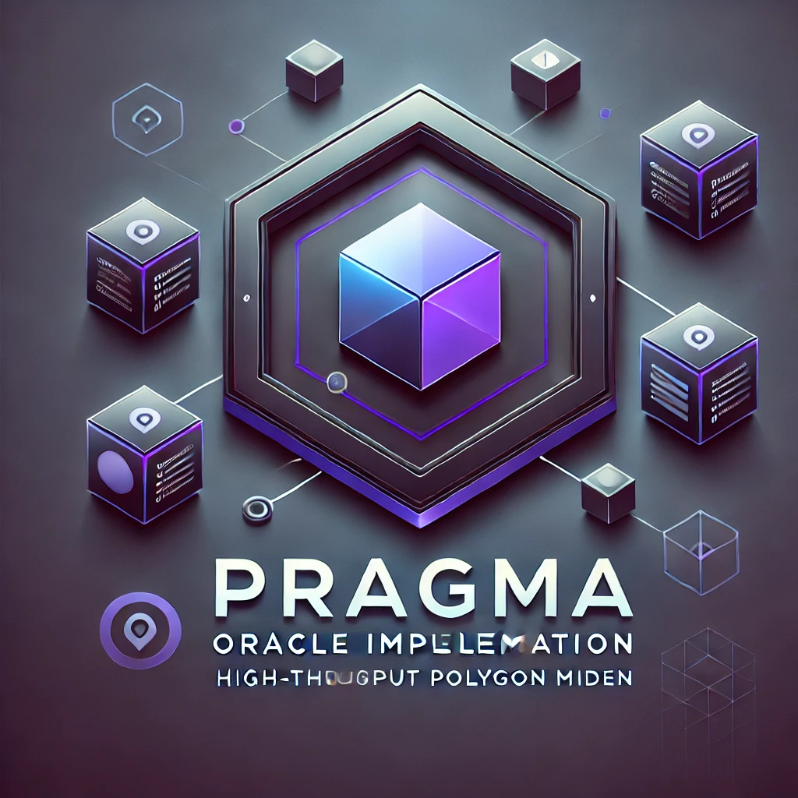

<!-- prettier-ignore-start -->
<!-- markdownlint-disable -->

<!-- ************************************* -->
<!-- *        HEADER WITH LOGO           * -->
<!-- ************************************* -->

  

<h1 align="center">👾 Pragma Miden 👾</h1>

  <strong>A MASM implementation of Pragma</strong>

  <a href="https://polygon.technology/polygon-miden">https://polygon.technology/polygon-miden</a>

<!-- ************************************* -->
<!-- *        BADGES                     * -->
<!-- ************************************* -->

 

<!-- ************************************* -->
<!-- *        CONTENTS                   * -->
<!-- ************************************* -->

This repository is an implementation of the Pragma protocol for Polygon Miden blockchain.
You can learn more about Miden [here](https://docs.polygon.technology/miden/).

## Supported Features
| Feature  |  Supported |
|---|---|
|  Oracle Account | ❌ |  
|  Publisher Registry Account | ❌ |  
|  Python SDK | ❌ |  

## Project structure

...