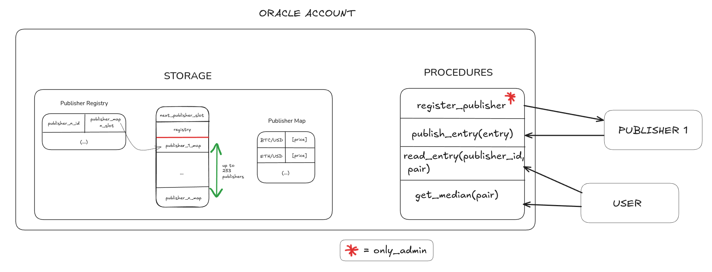

<p align="center">
  
</p>

<h1 align="center">Pragma Miden</h1>

This repository contains an implementation of the Pragma protocol for the Polygon Miden blockchain. Pragma Miden aims to provide a decentralized oracle solution specifically designed for the Miden network.

[You can find a demo here.](./.github/pragma-miden-demo.mp4)

## About Pragma Miden

Pragma Miden is a Rust-based implementation inspired by [Miden-Client](https://github.com/0xPolygonMiden/miden-client) that leverages the Miden VM to create and manage oracle accounts on the Polygon Miden rollup.

The project utilizes MASM instructions to implement oracle functionality securely and efficiently.

You can learn more about Miden [here](https://docs.polygon.technology/miden/).

## Design

<p align="center">
  
</p>

### Oracle Account

The Oracle acts as a central registry and aggregator with these key functions:
* Maintains a registry of trusted publisher ids (Supports up to 253 publishers),
* Retrieves the price of a publisher for a given faucet_id,
* Aggregates all the available prices into a median.

Storage Structure:
* `next_publisher_slot`: Value, tracks the next available slot for publisher registration,
* `publisher_registry`: Map of publisher_id -> assigned_slot for quick lookups (no need to iterate on the slots value everytime to know if a publisher is registered, for `get_entry` & `register_publisher`),
* publisher IDs in sequential slots Values for easy iteration when we make an aggregation.

Procedures:
* `register_publisher`: Add new trusted price sources (admin only),
* `get_entry`: Fetch a specific publisher's price for a faucet_id,
* `get_usd_median`: Calculate median price across all publishers for a faucet_id with tracking status.

### Publisher

Since a publisher cannot directly ask the Oracle to update its storage with a provided value, the publisher will be responsible for its own storage and publish prices to itself.

Its storage is a single map where the key is a word containing the faucet_id:
```
[faucet_id_prefix, faucet_id_suffix, ZERO, ZERO]
```

The faucet_id is a 128-bit identifier that maps to specific price feeds. See [FAUCET_ID_MAPPING.md](./FAUCET_ID_MAPPING.md) for details on mapping trading pairs to faucet IDs.

The value is a FaucetEntry type:
```rust
pub struct FaucetEntry {
    pub faucet_id: FaucetId,
    pub price: u64,
    pub decimals: u32,
    pub timestamp: u64,
}
```

Stored as: `[price, decimals, timestamp, ZERO]`


## Integrate as publisher

If you want to become a testnet publisher, follow these steps:

### Step 1: Build the CLI tools
First, build the Pragma tools with the release profile:
```bash
cargo build --release
```
This will create the executable binaries in the `target/release` directory.

### Step 2: Initialize your publisher account
Initialize a new publisher account:
```bash
./target/release/pm-publisher-cli init
```
This will:
- Create a new publisher account on the network
- Store your publisher ID and keys locally
- Display your publisher ID which you'll need for the next step

### Step 3: Request registration with the Oracle
Once you have your publisher ID, you need to be registered by the Oracle owner.

Send your publisher ID to the Oracle administrator and request registration. The Oracle owner will run:
```bash
./target/release/pm-oracle-cli register-publisher YOUR_PUBLISHER_ID
```

### Step 4: Start publishing price feeds
After your publisher has been registered, you can start pushing price data:
```bash
./target/release/pm-publisher-cli publish FAUCET_ID PRICE DECIMALS TIMESTAMP
```

For example:
```bash
./target/release/pm-publisher-cli publish 1:0 98179840000 6 1738593825
```

In this example:
- `1:0` is the faucet_id (representing BTC/USD in our reference mapping)
- `98179840000` is the price (98,179.84 with 6 decimal places)
- `6` is the number of decimal places 
- `1738593825` is the Unix timestamp when the price was observed

**See [FAUCET_ID_MAPPING.md](./FAUCET_ID_MAPPING.md) for the complete faucet_id mapping reference.**

The Oracle will now include your price data when calculating median values for the specified faucet_ids.

## Integrate as consumer

### Query Single Faucet ID

```bash
./target/release/pm-oracle-cli median 1:0 --network testnet
# Output:
# ✓ Faucet ID 1:0 is tracked
# Median value: 76436215000
# Amount (preserved): 1000000
```

### Query Multiple Faucet IDs (Batch - 47% Faster)

```bash
./target/release/pm-oracle-cli median-batch 1:0 2:0 3:0 --network testnet --json
# Output: [{"faucet_id":"1:0","median":76436215000,"is_tracked":true},{"faucet_id":"2:0","median":2294430000,"is_tracked":true},{"faucet_id":"3:0","median":100730000,"is_tracked":true}]
```

The batch command optimizes performance by syncing state once instead of per-faucet_id, reducing query time from ~4.7s to ~2.5s for 3 queries.

**Note:** The new `get_usd_median` interface includes an `is_tracked` flag. If a faucet_id is not supported by the oracle, it returns `is_tracked=false` instead of throwing an error, preventing transaction failures for spending limits and other use cases.

### Integration Guides

For developers who want to consume oracle data in their applications:
- **Faucet ID Mapping**: See [FAUCET_ID_MAPPING.md](./FAUCET_ID_MAPPING.md) for pair-to-faucet_id mapping and migration guide
- **API Documentation**: See [GET_USD_MEDIAN.md](./crates/accounts/GET_USD_MEDIAN.md) for complete `get_usd_median` API reference
- **CLI Integration**: See [OPTIMIZATION.md](./OPTIMIZATION.md) for batch query performance details
- **Demo Examples**: Refer to the [demo folder](./crates/demo/README.md) for integration examples
- **Frontend Integration**: Check [oracle-explorer/ARCHITECTURE.md](./oracle-explorer/ARCHITECTURE.md) for Next.js integration

## License

This project is licensed under the MIT License - see the [LICENSE](LICENSE) file for details.

## Deployments

### Testnet

These contracts were deployed for testing purpose only. They might change in the future.

Oracle - [mtst1ar2frsv7kjz2gqzt2mt74d0xlyen8re3](https://testnet.midenscan.com/account/mtst1ar2frsv7kjz2gqzt2mt74d0xlyen8re3)

Publisher1 - [mtst1aqwdujtul020gqz8dlc6v00lgunczddf](https://testnet.midenscan.com/account/mtst1aqwdujtul020gqz8dlc6v00lgunczddf)

Publisher2 -  [mtst1apkfkmest8g2sqq6qct5jt6s9s7834t6](https://testnet.midenscan.com/account/mtst1apkfkmest8g2sqq6qct5jt6s9s7834t6)
