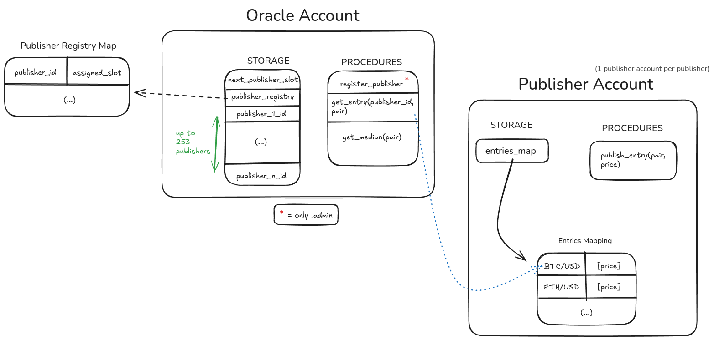

<p align="center">
  
</p>

<h1 align="center">Pragma Miden</h1>

This repository contains an implementation of the Pragma protocol for the Polygon Miden blockchain. Pragma Miden aims to provide a decentralized oracle solution specifically designed for the Miden network.

## About Pragma Miden

Pragma Miden is a Rust-based implementation inspired by [Miden-Client](https://github.com/0xPolygonMiden/miden-client) that leverages the Miden VM to create and manage oracle accounts on the Polygon Miden rollup.

The project utilizes MASM instructions to implement oracle functionality securely and efficiently.

You can learn more about Miden [here](https://docs.polygon.technology/miden/).

## Design

<p align="center">
  
</p>


### Oracle Account

The Oracle acts as a central registry and aggregator with these key functions:
* Maintains a registry of trusted publisher ids (Supports up to 253 publishers),
* Retrieves the price of a publisher for a given pair,
* Aggregates all the available prices into a median.

Storage Structure:
* `next_publisher_slot`: Value, tracks the next available slot for publisher registration,
* `publisher_registry`: Map of publisher_id -> assigned_slot for quick lookups (no need to iterate on the slots value everytime to know if a publisher is registered, for `get_entry` & `register_publisher`),
* publisher IDs in sequential slots Values for easy iteration when we make an aggregation.

Procedures:
* `register_publisher`: Add new trusted price sources (admin only),
* `get_entry`: Fetch a specific publisher's price for a trading pair,
* `get_median`: Calculate median price across all publishers for a pair.

### Publisher

Since a publisher cannot directly ask the Oracle to update its a storage with a provided value, the publisher will be responsible of its own storage and publish prices to itself.

Its storage will only be a single map. The key is a word containing the pair, example:
```
[pair, ZERO, ZERO, ZERO]
```
For now, it only contains the pair but we can imagine that it will hold more information later, for example the source, the type of the asset etc...:
```
[SPOT, BINANCE, pair_name, ZERO]
or
[FUTURE, BYBIT, pair_name, ZERO]
```

The value is an Entry type:
```rust
pub struct Entry {
    pub pair: Pair,
    // TODO(akhercha): We may prefer a u128 for more precision.
    // This can probably done by storing a Price(low, high) struct with two u64s.
    // We can remove the "pair" field for that? Since it's possible to find it using the mapping?
    pub price: u64,
    pub decimals: u32,
    pub timestamp: u64,
}
```

Converted to a Word.

## License

This project is licensed under the MIT License - see the [LICENSE](LICENSE) file for details.
